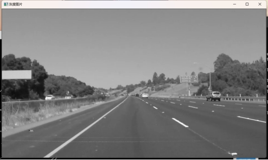
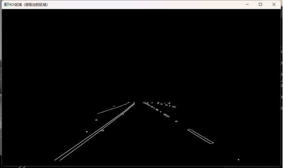
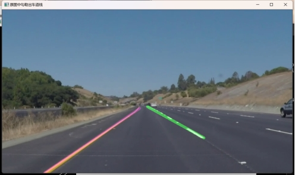

# 车道线检测

> 引入：针对路面标线检测是实现车道偏离预警的关键技术，对于实现车辆的完全自主驾驶具有重要的意义。

## 一、选题分析与理解：

1. 车道线检测是自动驾驶和驾驶辅助系统中的关键任务之一，针对路面标线检测是实现车道偏离预警的关键技术，对于实现车辆的完全自主驾驶具有重要的意义。OpenCV是一个广泛使用的计算机视觉库，可以用来进行车道线检测。
2. 车道线检测的基本原理是通过图像处理和计算机视觉技术在***\*图像或视频帧中提取出车道线的位置信息\****。具体如下几个模块处理：

 图像预处理：将彩色图像转换为灰度图像，使用cvtColor函数来实现。

 边缘检测：利用Canny边缘检测算法，使用Canny函数来实现。Canny算法能够检测图像中的边缘，并输出一个二值图像，其中只包含边缘点。

 区域兴趣提取（ROI区域提取）：车道线通常在图像的下半部分出现，因此需要定义一个感兴趣的区域来提取车道线。fillPoly函数创建一个多边形mask，将非感兴趣区域的像素设为0。之后在使用bitwise_and函数将兴趣区域图像导入（简单来说就是将车道线的位置通过计算后抠出）

 轮廓提取：提取轮廓，对轮廓的边框进行分析除去一些不符合的，在用借助椭圆进行拟合出轮廓。轮廓提取可以使用findContours函数，之后遍历所有的轮廓分析，除去角度、面积都过于不符合的，之后用drawContours函数将轮廓描出。

 直线拟合：对轮廓分为左下部分（左车道）和右下部分（右车道）进行向量取点之后将点拟合得到目标线。这里向量取点使用push_pack填入找到的点，拟合时借助line函数得到。

流程如下：

 

## 二、自定义函数原型以及核心代码片段如下：

```c++
void process(Mat& frame,Point* left,Point* right_line);
Mat fitLines(Mat& image, Point* lift_line, Point* right_line);
```

process函数用于用于对图片进行操作得到目标线段（包括图片灰度化，边缘检测，区域提取.....）

```c++
cvtColor(frame, gray, COLOR_BGR2GRAY);//灰度化
Canny(gray, binary, 100,150);//canny算子边缘检测
bitwise_and(binary, mask, roi_binary);//对二值化（边缘）填入掩码
//寻找轮廓findContours
//二值化图像中查找对象的轮廓，并将找到的轮廓保存在contours这个容器中
//二值化图片	保存容器	检测外侧	压缩
findContours(roi_binary, contours, RETR_EXTERNAL,CHAIN_APPROX_SIMPLE);
```

fitLines函数主要是轮廓进一步的提取分析之后绘制出车道线（通过斜率的计算过滤一部分线段，）

```c++
//遍历左下部分，找到左车道线
for (int i = 100; i < (cx - 10); i++)
{
	for (int j = cy; j < height; j++)
	{
		int pv = image.at<uchar>(j, i);
		if (pv == 255)
		{	//提取左车道线的点集
			left_pts.push_back(Point(i, j));
		}
	}
}
	//拟合左车道
	if (left_pts.size() > 2)		//点数大于2
	{
		//拟合一条直接到左车道点集上
		fitLine(left_pts, left, DIST_L1, 0, 0.01, 0.01);
		double k1 = left[1] / left[0];
		double step = left[3] - k1 * left[2];
		int x1 = int((height - step) / k1);
		int y2 = int((cx - 25) * k1 + step);
		Point left_spot_1 = Point(x1, height);
		Point left_spot_end = Point((cx - 25), y2);
		line(out, left_spot_1, left_spot_end, Scalar(128, 0, 128), 8, 8, 0);
		//承接上一张的点
		left_line[0] = left_spot_1;
		left_line[1] = left_spot_end;
	}
	else
	{
		line(out, left_line[0], left_line[1], Scalar(128, 0, 128), 8, 8, 0);
	}
```

## 三、运行界面截图：

	 

​								灰度化处理																						边缘检测

 

	 

​								特定区域提取																				绘制车道线

 

## 四、总结

车道线检测是自动驾驶和驾驶辅助系统中的关键任务之一，针对路面标线检测是实现车道偏离预警的关键技术，对于实现车辆的完全自主驾驶具有重要的意义。在我的算法中，运用边缘检测，POI区域获取，轮廓提取，点数拟合成线基本可以实现车道线的检测。除此以外，我还利用了椭圆拟合的算法，将轮廓的边缘进行修正和进行一步的加工，使后面更容易提取到所需的点集；在点集处理处，也通过遍历寻找车道线的点集，斜率评估和筛选，让符合要求的点集留下，不符合的进行微调或者移除，保证了绘制出的车道线可以更好的贴近实际车道线，更加符合实际的需求。

算法也需要很多需要调整的地方，比如：ROI区域获取时如何能够将不同场景，不同尺寸的图像处理，在保证减少噪声的情况下，还能够得到需要检测的区域.....

有一句这样说：“数学决定你学计算机的深度，英语决定你学计算机的广度。”在这个项目里我深有体会，需要不断的去测量坐标、计算坐标、计算斜率估计值...建立数学模型，将数学思维始终贯彻整个算法！

具体可以联系邮箱：libai9123@outlook.com

<!--2024.1.11--> **大一上学期期末作业：优秀**
